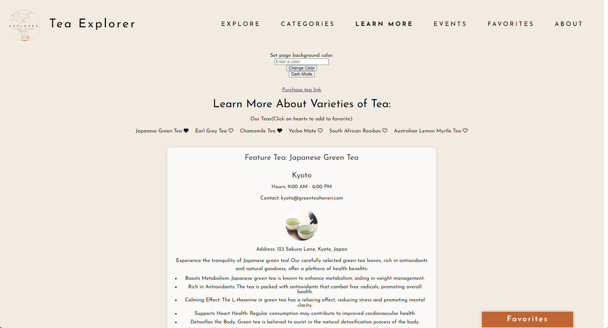
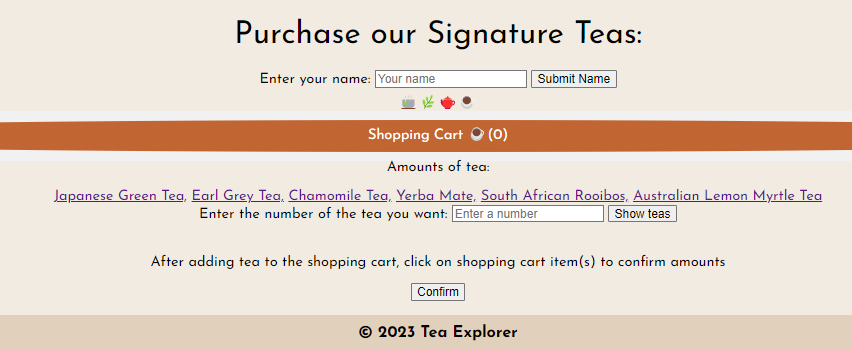
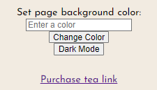
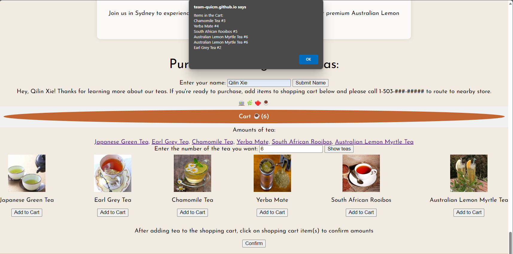
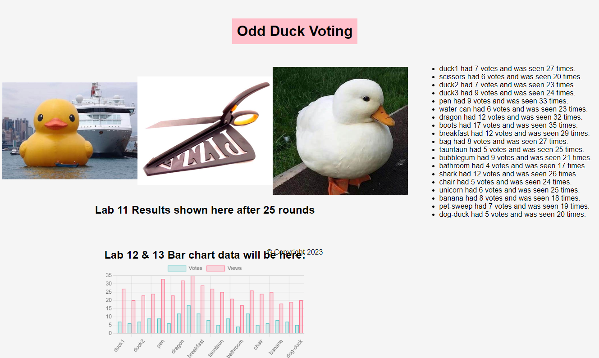
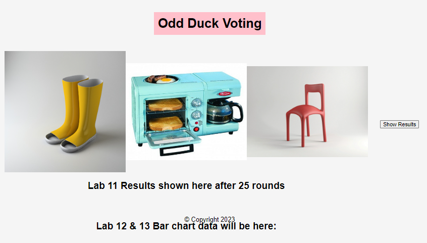
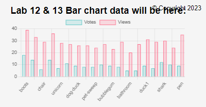
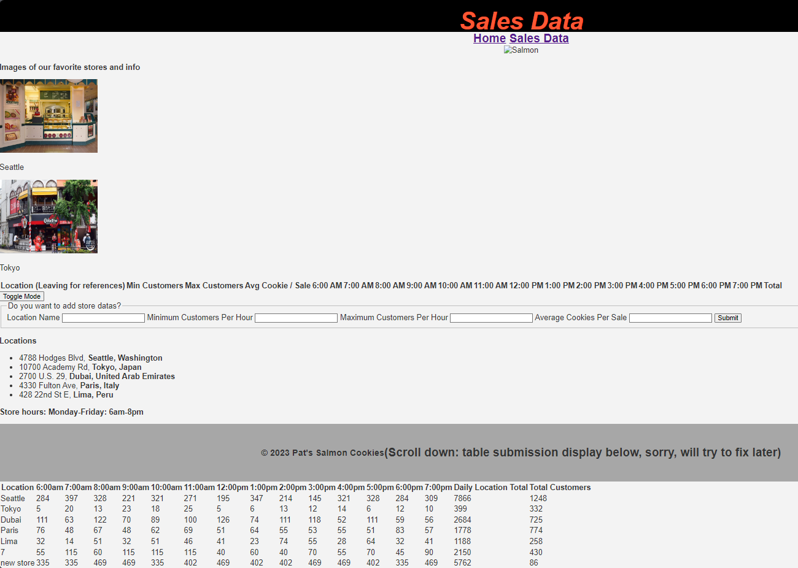
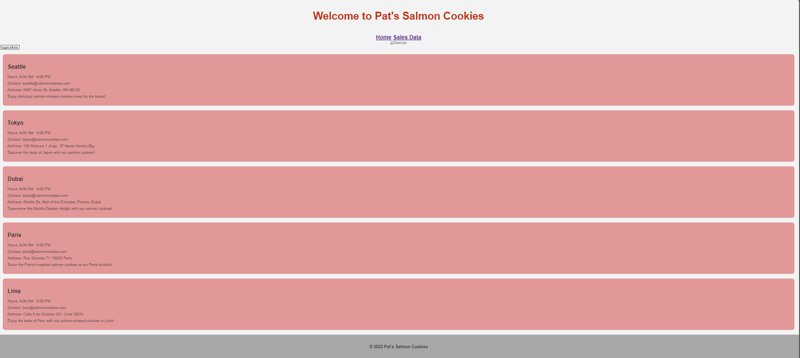
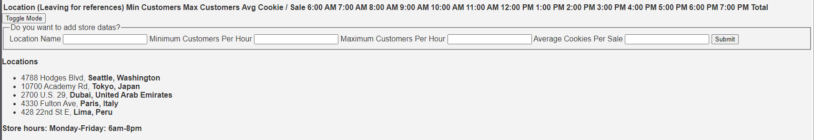

# portfolio-prep
Qilin's Portfolio with home page and about page

- 👋 Hi, I’m @QILINXIE02, a front end developer based in Portland OR area. 
- 👀 I’m interested in leveraging tech for impactful solutions. I am on a mission to build connections of education and technology when I become a coding instructor.
- 🌱 I’m currently learning full stack dev.
- 💞️ I’m looking to collaborate on projects that merge coding and education
- 📫 How to reach me: [Linkedin](https://www.linkedin.com/in/qilinxie/)

 I spend most of my free time creating things! I like making websites, cooking, and spending times biking. Before learning software development my background was in Education. Thank you for visiting! Feel free to look around a leave a comment on a project! 

team project Qilin's page: 

Odd duck project:  

Salmon cookies project:   

